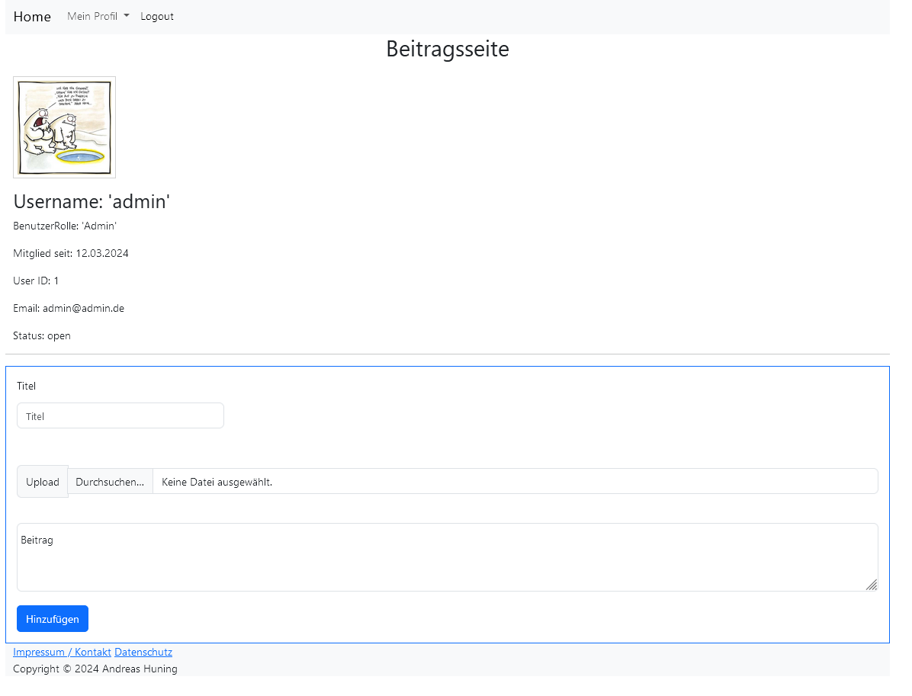

# Blog-with-registration-PHP
 
Daten in das XAMPP htdocs Verzeichnis kopieren
Apache und SQL Server in XAMPP starten

SQL:
phpmyadmin aufrufen: http://localhost/phpmyadmin/
Datenbank "blog.sql" aus dem Ordner _sql im phpmyadmin importieren

Terminal:
composer install ausführen

Login: 
Mail: admin@admin.de
Passwort: 1234

Auf der Startseite werden alle Beiträge angezeigt

Der Link BENUTZER REGISTRIERUNG PRÜFEN funktioniert nur, nachdem man sich registriert hat.
Der E-Mail versand funktioniert. Ich habe aber das senden auskommentiert und mein Passwort entfernt. Hier müssen die entsprechenden Daten eingetragen werden.
Es muss also über den Link auf der Startseite der Registrierungsvorgang abgeschlossen werden.

Profilseite: (Weiterleitung nach dem Login)
Hier kann ein Profilbild hochgeladen oder die E-Mail oder das Passwort geändert werden.

Benutzerdaten anpassen:
Hier können die allgemeinen Angaben wie Name und Geburtsdatum eingetragen werden
Eine Änderung überschreibt immer die aktuellen Daten

Adresse anpassen:
Hier können verschiedene Adressen mit Namen angelegt werden.
bei gleichen Namen werden die Daten überschrieben.

Post erstellen:
Hier kann ein post erstellt werden.
Alle Felder sind Pflichtfelder.
Die Posts werden auf der Startseite nach Datum absteigend sortiert angezeigt.

